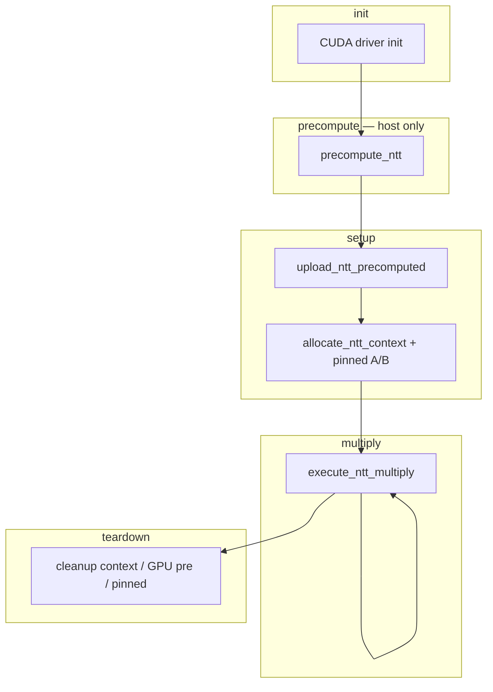

# GPU multiply timing model

How wall-clock time is spent in the birdwing GPU multiply pipeline, how it maps
to code, and how benchmarks measure it.

See [ROADMAP.md](../ROADMAP.md) for architecture and module layout.

## The five buckets

| Bucket | When it runs | Depends on | Amortization |
|--------|--------------|------------|--------------|
| **init** | First CUDA use in a process | — | Once per process |
| **precompute** | Once per transform size `N` | `N`, `LIMB_BITS`, RNS primes | Once per `N`; **host-only, cacheable to disk** |
| **setup** | Before a batch of multiplies at a given size | `N`, `L_A`, `L_B` | **Once per size** — amortize over many multiplies at that size |
| **teardown** | After the batch (or on shutdown) | Same as setup | Paired with setup; skip until the size is done |
| **multiply** | Every `A × B` | Operand values | Never amortized |

Only **multiply** runs on every call. **precompute**, **setup**, and **teardown**
are fixed costs for a given size; divide by the number of multiplies at that
size to get per-multiply overhead.

### precompute vs setup

**precompute** is **host-only**: NTT parameters, twiddle tables in RAM, Garner
CRT coefficients. No `cudaMalloc` / H2D. Safe to save to disk and reload without
a GPU.

**setup** is **everything that touches the GPU** before the multiply loop:

- `upload_ntt_precomputed` — H2D twiddles, modulus / n⁻¹, Garner constants
- `allocate_ntt_context` — mutable operand / CRT / carry buffers
- pinned host buffers for `A` and `B`

### Same-size batches

Keep `NTTPrecomputed` (host tables) and `NTTContext` (GPU buffers) alive across
many **multiply** calls at the same `(L_A, L_B)` / `N`. Call **teardown** only
when that size batch ends.

```
L_C = L_A + L_B - 1
N   = padded_ntt_size(L_A, L_B)
```

## Lifecycle



## init

First CUDA API call in a process can cost hundreds of milliseconds.

`bench_full_multiply_32` calls `warmup_cuda_runtime()` once before the `L`
sweep so **init** is not attributed to the first bar.

## precompute

**API:** `precompute_ntt(N, PrecomputeTiming* timing_out = nullptr)`  
**Produces:** `NTTPrecomputed` with host twiddle tables; `gpu_uploaded == false`.

| `PrecomputeTiming` field | Measures |
|--------------------------|----------|
| `factors_ms` | `generate_factors_for_N` |
| `params_ms` | `NTTParameters` construction per modulus |
| `twiddle_host_ms` | `gpu_root_of_unity_table_generator` (fwd + inv) |
| `garner_host_ms` | `compute_garner_params` |
| `total_ms` | Wall clock (host only) |

Host data lives in `forward_omega_host` / `inverse_omega_host` and is the
natural **disk-cache payload**. Re-upload via `upload_ntt_precomputed` after
load without re-running host generation.

## setup

**Upload API:** `upload_ntt_precomputed(pre, SetupUploadTiming* timing_out = nullptr)`  
Must run before `allocate_ntt_context`. Idempotent if already uploaded.

| `SetupUploadTiming` field | Measures |
|---------------------------|----------|
| `twiddle_upload_ms` | Twiddle `cudaMalloc` + H2D + sync drain |
| `mod_constants_ms` | Modulus and n⁻¹ H2D |
| `garner_upload_ms` | `upload_garner_params` |
| `total_ms` | Wall clock for upload |

**Context API:** `allocate_ntt_context(pre, L_A, L_B)` — mutable GPU buffers
(requires `pre.gpu_uploaded`).

**Pinned operands:** `cudaMallocHost` + `memcpy` for `A` / `B`.

**Benchmark columns:** `setup_upload_ms`, `setup_alloc_ms`, `setup_pinned_ms`,
`upload_*` breakdown.

## teardown

- `cleanup_ntt_context(ctx)` — frees mutable GPU buffers
- `cleanup_ntt_precomputed(pre)` — frees **GPU** twiddle / constant allocations;
  **host** tables remain so `upload_ntt_precomputed` can run again without full
  precompute
- `cudaFreeHost` — pinned A/B

Defer **teardown** until the size batch is finished. You may free context only
and keep host precompute for another upload cycle at the same `N`.

## multiply

**API:** `execute_ntt_multiply(..., NTTTiming* timing_out = nullptr)`

| `NTTTiming` field | Stackable? |
|-------------------|------------|
| `ingress_fwd_ms` | Yes |
| `pointwise_mul_ms` … `d2h_ms` | Yes |
| `h2d_ms`, `fwd_pad_ntt_*` | Diagnostics only (streams overlap) |

## Benchmarks and CSV

```bash
make bench_full_32
./build/bench_full_multiply_32 --warmup 2 --iters 20 --csv gpu_multiply_bench.csv
python scripts/plot_bench.py gpu_multiply_bench.csv
```

Per `L`: single-shot **precompute**, **upload**, **setup** alloc/pinned,
averaged **multiply**, single-shot **teardown**.

| Columns | Bucket |
|---------|--------|
| `setup_precompute_ms`, `pre_*` | precompute (host) |
| `setup_upload_ms`, `upload_*` | setup (GPU upload) |
| `setup_alloc_ms`, `setup_pinned_ms` | setup |
| `mean_ms`, stage columns | multiply |
| `teardown_*` | teardown |

## Code map

| Bucket | API | Timing |
|--------|-----|--------|
| init | (implicit) | — |
| precompute | `precompute_ntt` | `PrecomputeTiming` |
| setup | `upload_ntt_precomputed`, `allocate_ntt_context`, `cudaMallocHost` | `SetupUploadTiming`, `setup_*` |
| teardown | `cleanup_ntt_context`, `cleanup_ntt_precomputed`, `cudaFreeHost` | `teardown_*` |
| multiply | `execute_ntt_multiply` | `NTTTiming` |
| Legacy | `host_multiply_merge` | `duration` |

Correct sequence:

```cpp
NTTPrecomputed pre = precompute_ntt(N);
upload_ntt_precomputed(pre);
NTTContext ctx = allocate_ntt_context(pre, L_A, L_B);
// ... execute_ntt_multiply in a loop ...
cleanup_ntt_context(ctx);
cleanup_ntt_precomputed(pre);  // optional; frees GPU copy of pre
```
